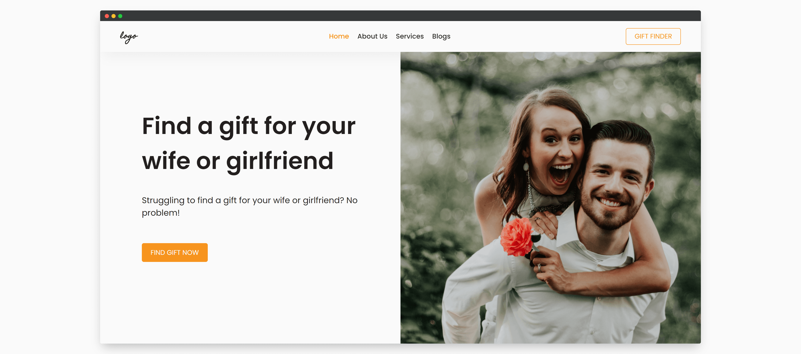

# Gift Store Landing Page



## Getting Started

1. Install all dependencies:

```bash
npm install
# or
yarn install
```

2. Run the development server:

```bash
npm start
# or
yarn start
```

3. Happy Coding!

## Learn More

- [React Documentation](http://reactjs.org/) - learn about React features and API.
- [Framer Motion Documentation](https://framer.com/api/motion) - learn about Framer Motion API.
